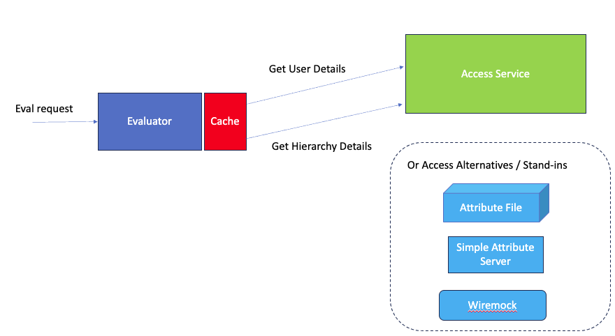

# RDF ABAC Evaluator
This is a REST service encompassing the RDF ABAC label evaluation service. You can find out more at the [rdf-abac](https://github.com/Telicent-io/public-rdf-abac) repo for more details).

Simply put, the evaluator calls the Access Service for user and hierarchy information, which is cached in an age-off
manner, it then makes use of the rdf-abac evaluator to establish whether the given request evaluates true or false.



As illustrated above, and described below, the Access Service can be replaced with either a data file, a simplified 
attribute server or, for testing purposes, an instance of WireMock.

## Background
### RDF
RDF (Resource Description Framework) is a standardized model for representing and linking data on the web using 
triples. You can find out more [here](docs/rdf.md)

### ABAC
ABAC (Attribute-Based Access Control) decides who can access what based on specific qualities of users, resources, and the environment they're in.
You can find out more [here](docs/abac.md)

### RDF-ABAC
RDF ABAC provides access control on data. Each data item has an associated attribute expression and a data item is only visible to the application if the attribute expression evaluates to "true". 
The attributes are evaluated in the context of a data access request (query); the user has a number of attributes which represent the permissions.

For example: a user making a query request has key-value attributes `"role=engineer"` and `"status=employee"`. 
Data visible to the query request includes triples labelled `"role=engineer"` or `"status=employee"`.


## REST API
The API provides only a single operation:
- `POST /eval?user=<user>&label=<label>` for evaluating a label using the attributes for a specific user.

### Sample Request
```bash
curl -X POST "http://localhost:64431/eval?user=exampleUserId&label=credentials=phd"
```

### Results
The API response is a JSON string containing the user for whom the request was made and a flag indicating the result.
i.e.
```json
{
  "user" : "exampleUserId",
  "result" : "true" 
}
```

## Build
You can find information on how to build the repo [here](docs/build.md)

## Run 
You can find information on how to run the app [here](docs/run.md)

## Configuration
You can find information on how to configure the app [here](docs/config.md)

## Further work
Obviously more work can be carried out in the repo. You can find out more [here](docs/further.md)